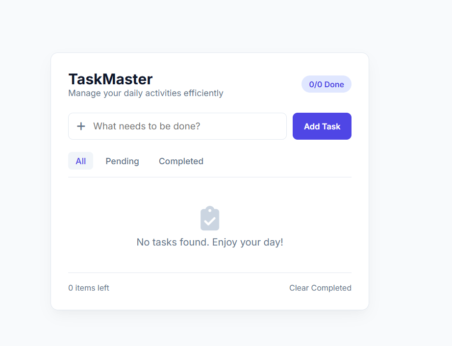
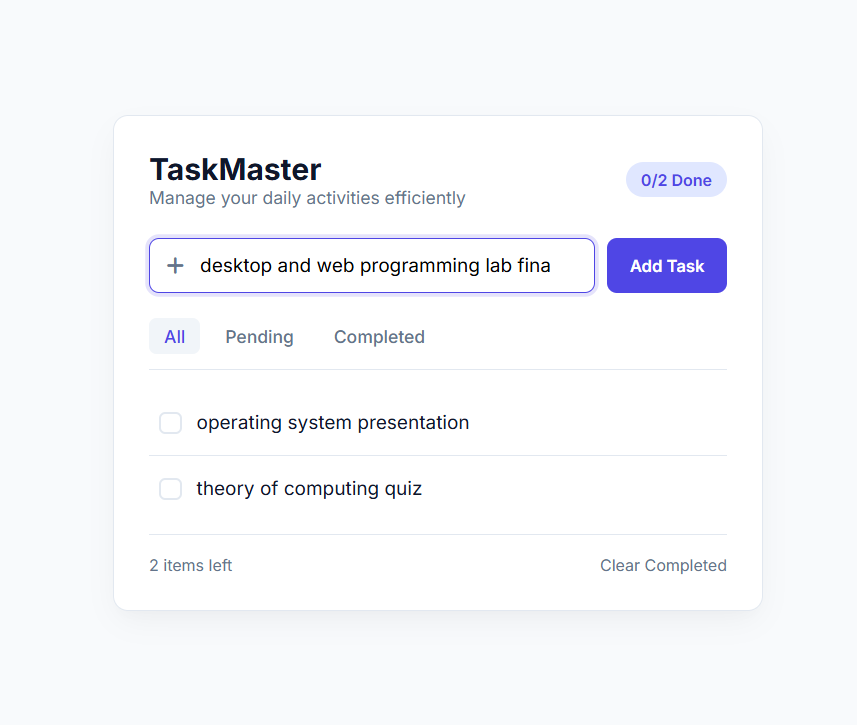
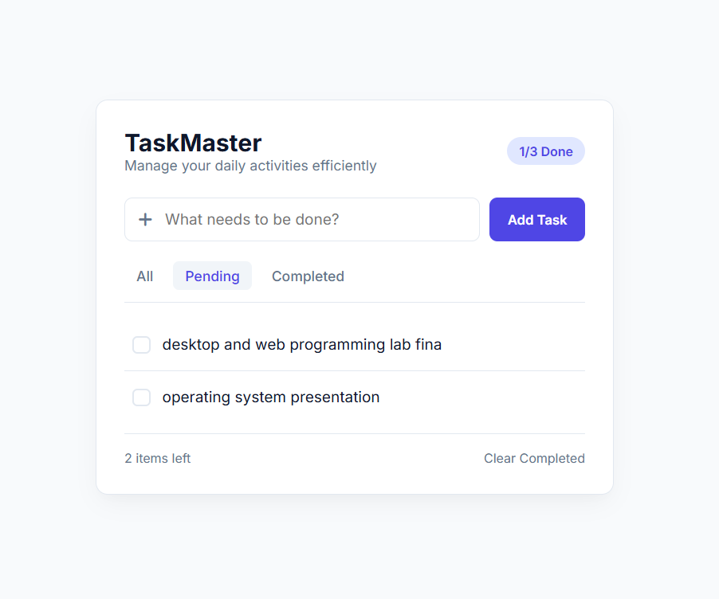
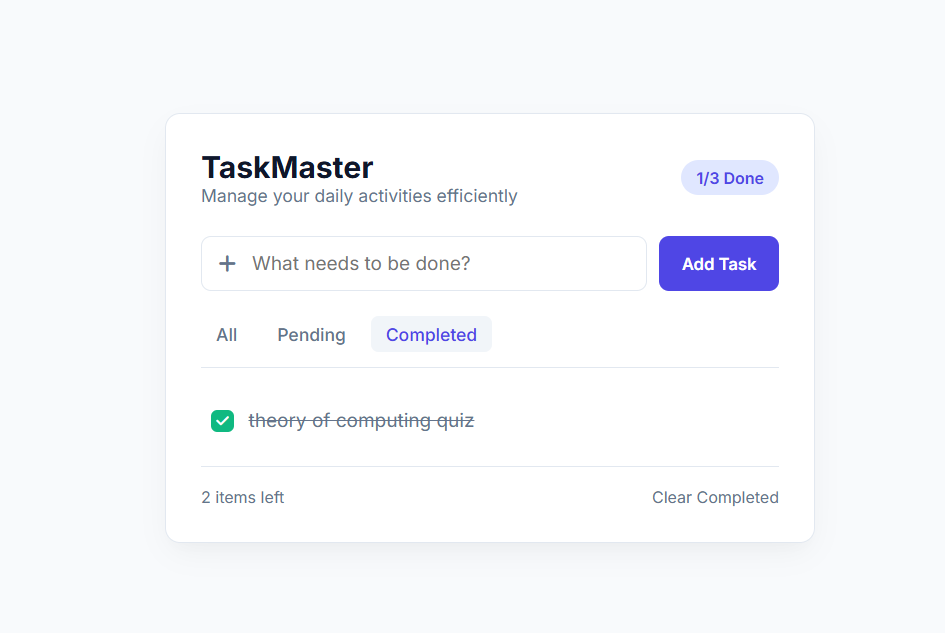

# Smart To-Do List App

An interactive, responsive web application built with HTML, CSS, and JavaScript that helps users organize daily tasks, set priorities, and track productivity efficiently.

🌐 **Live Demo:** [Click Here to View App]( https://nawrin30.github.io/To-do-app/ )

---

## Features

* **Task Management:** Add, edit, mark as complete, and delete daily tasks effortlessly.
* **Priority & Category Tags:** Organize tasks by priority levels (High, Medium, Low) and categories (Work, Personal, Study).
* **Progress Tracking:** Interactive progress bar and completion statistics powered by dynamic UI updates.
* **Filter & Search:** Easily filter tasks by status (All, Active, Completed) or search specific items in real-time.
* **Local Data Persistence:** Saves your task list in LocalStorage so your data stays intact even after refreshing or closing the browser.
* **Dark / Light Theme:** Toggle between custom themes for a comfortable visual experience.

---

## How to use

1. Type your task title, choose a category, and set a priority level.
2. Click **Add Task** to save it to your daily list.
3. Use the **Filter** buttons or **Search Bar** to find specific tasks.
4. Click the checkmark icon to mark a task as completed, or click the trash icon to delete it.

---

## Dashboard Preview

---

## Files

* `index.html` - Semantic HTML5 structural markup and UI elements
* `style.css` - Modern styling using CSS Grid, Flexbox, transitions, and dark/light mode variables
* `script.js` - Dynamic DOM manipulation, filtering logic, and LocalStorage data management

---

## Author

**Nawrin Tarannum**!